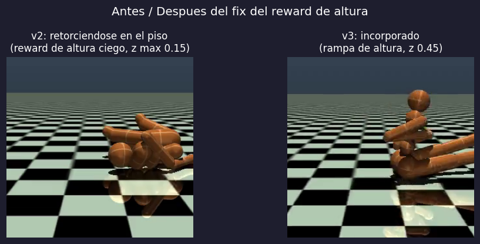
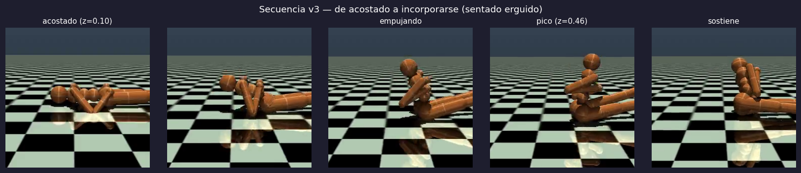

# Diapositivas — Proyecto DAG Reward Humanoide

> 3 diapositivas para presentación. Cada bloque `---` separa una diapositiva.
> Las imágenes referenciadas están en la raíz del repo.

---

## Diapositiva 1 — El problema y la idea del paper

### De rodar a caminar: recompensas DAG para un humanoide

**Clase:** Robótica Cognitiva — UAEM &nbsp;·&nbsp; **Autores:** Alan Cabrera y Enrique Albarrán
**Paper base:** Meng & Xiao (2023), *From Rolling Over to Walking* (arXiv:2303.02581)
**Tarea:** enseñar a un humanoide de 17 DoF (`HumanoidStandup-v4`, MuJoCo) a incorporarse desde el suelo, con **PPO** en una **laptop RTX 4050**.

**Idea central del paper — recompensa como grafo (DAG) con *achievement triggers*:**
En vez de una sola recompensa para toda la tarea, se encadenan habilidades
(`lift → standup → upright`); el bono de una habilidad **solo se activa** cuando
la anterior supera un *passing score*. Esto evita la recompensa dispersa.

```
A_ij,t = max(A_ij,t-1,  R_i,t − PS_ij)        R_t = Σ_i Σ_j  A_ij,t · R_j,t
```

**Adaptación a hardware de consumo:** MuJoCo CPU (no Isaac Gym), 17 DoF (no iCub
32 DoF), ~3–6M steps (no decenas de millones), + señales CPG, *action clamping*
y representación ego-céntrica.

---

## Diapositiva 2 — El proceso: depurar el reward hasta que el robot se levanta

**El valor del proyecto está en el debugging, no solo en el resultado.**

| Iter. | Qué pasó | Lección |
|-------|----------|---------|
| v1 | *passing score* inalcanzable | el bono nunca se activaba |
| v2 | reward de altura **ciego**: `clip(z−0.30)` = gradiente 0 en z∈[0.08, 0.15] | señal densa que es **sparse de facto** |
| **v3** | **fix:** rampa de altura continua desde el suelo → **el robot se sienta** ✅ | medir la cantidad física (`z`), no solo las métricas de PPO |
| v4 | `feet_tuck` + warm-start no escapa la pose en "L" ❌ | un bono tímido no saca de un óptimo local |

**Resultado (v3):** el robot pasa de **retorcerse acostado** a **incorporarse y
sentarse erguido**.
`z`: 0.15 → **0.45** · 42 % del tiempo con el torso despegado del suelo · `std`
de PPO estable (0.94) tras corregir hiperparámetros.



---

## Diapositiva 3 — Hallazgos, límites y conclusión

**Hallazgos de RL (transferibles a cualquier proyecto de reward shaping):**
1. **Sparse de facto:** un reward "denso" no sirve si su gradiente está fuera de
   la región donde el agente realmente opera (bug v2, hallado midiendo `z`).
2. **Reward hacking:** el agente explota la señal más fácil (ángulos de
   articulación, pose en "L") en vez del objetivo.
3. **Proxy ≠ objetivo:** en v4 el reward total *subió* mientras la altura *bajó*.
4. Salir de un óptimo local estable exige más que una recompensa positiva débil:
   penalización activa, más exploración o *curriculum*.

**Limitaciones:** 1 sola semilla por config · presupuesto de muestras 2–3
órdenes de magnitud menor que el paper · robot y simulador distintos · no llega
a pararse del todo (techo del presupuesto, no del método).

**Conclusión:** se implementó la contribución central del paper (DAG con
*achievement triggers* + CPG + ego-centric) y se llevó al robot de *acostado* a
*sentado erguido* en hardware de consumo, con un proceso de diagnóstico
riguroso y honesto documentado iteración por iteración.



**Repo:** github.com/AlanoHater/robot-ppo · rama `feature/multipath-dag-egocentric`
